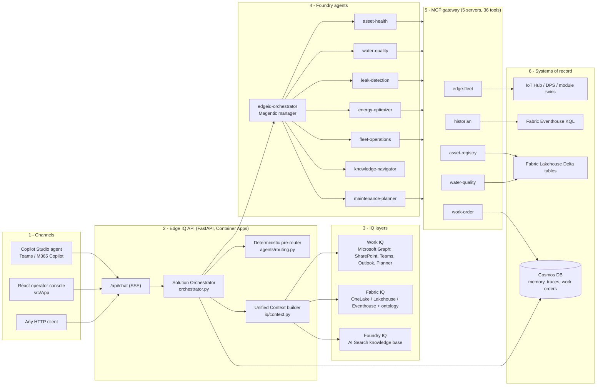
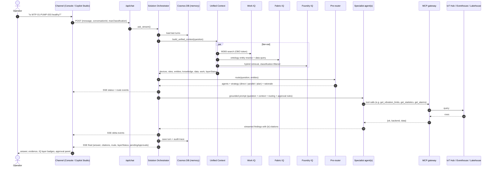
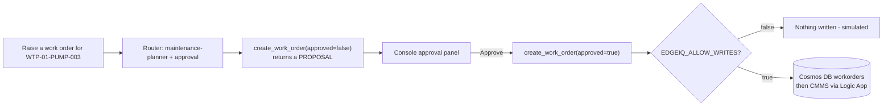

# Edge IQ: End-to-End Architecture Flow

This document follows one operator question through Edge IQ, from the moment it is asked to the moment an answer comes back. It also covers how data gets into the platform in the first place. For component reference, see [docs/architecture.md](docs/architecture.md). For the live Azure resources, see [AZURE_RESOURCES.md](AZURE_RESOURCES.md).

---

## 1. The big picture

---

## 2. How data gets in (ingestion flow)

Answers are only as good as the data behind them. Data arrives on four paths:

1. **Edge devices to cloud.** IoT Edge gateways at treatment works, pump stations, reservoirs, wells and DMAs collect PLC/SCADA tags (vibration, pressure, flow, kW, chlorine, turbidity, pH). They buffer offline and publish to **IoT Hub**. Device identity comes from **DPS** with X.509 certificates.
2. **Hot path.** IoT Hub routes to a **Fabric Eventstream**, which lands raw telemetry in the **Eventhouse (KQL)** for second-level queries, alarms and anomaly checks.
3. **Warm/cold path.** Fabric notebooks (`fabric/notebooks/`) run medallion jobs in the **Lakehouse**: bronze (raw) to silver (cleaned, hourly) to gold (KPIs, compliance, NRW, energy). Everything is stored as Delta in **OneLake**, so Power BI, the Data Agent and MCP servers all read one copy.
4. **Reference and knowledge.**
   - The asset register, regulatory limits, calibration records and crews are loaded as Lakehouse tables.
   - SOPs, OEM manuals and standards (`documents/knowledge-base/`) are chunked and indexed into **Azure AI Search**, which becomes **Foundry IQ**.
   - SharePoint, Teams and Outlook content stays in M365 and is reached live through **Work IQ**.

In demo mode, the same shapes are served from `data/customdata/*.csv` and the local knowledge-base JSON, so every flow below works without Azure.

---

## 3. How a question is answered (request flow)

### Step by step

| # | Stage | What happens | Code |
|---|---|---|---|
| 1 | **Channel** | The operator asks in the React console, Teams (via Copilot Studio) or any HTTP client. Copilot Studio forwards to the same API through the custom connector. | `src/App`, `copilot-studio/` |
| 2 | **API** | `/api/chat` validates the request, reads the user identity (Easy Auth header) and the bearer token (used for Work IQ On-Behalf-Of), and opens an SSE stream. | `chat.py` |
| 3 | **Memory** | The last turns of the conversation load from Cosmos `agent_memory` so follow-up questions work. | `memory.py` |
| 4 | **Entity extraction** | Regex pulls device IDs (`WTP-01-PUMP-003`) and site/DMA IDs (`RES-03`, `DMA-14`). The Fabric ontology resolves words like "pump" and "reservoir" to entity types. | `iq/context.py`, `fabric/ontology/` |
| 5 | **IQ fan-out** | The three IQ layers are queried **concurrently**, and each can fail independently. `layerStatus` records `ok`, `demo`, `local`, `placeholder` or `error` so the UI and the model know what was really consulted. | `iq/*.py` |
| 6 | **Routing** | The deterministic pre-router scores every specialist on triggers, entities and hard rules (for example "offline" goes to fleet-operations, "raise a work order" to maintenance-planner, and a "briefing" fans out to 5 agents). It picks **direct** (one agent), **parallel** (several) or **plan** (hand off to the Magentic manager). | `agents/routing.py` |
| 7 | **Approval gate** | If the question implies a write (create/update/assign work order), `pendingApprovals` is populated and the prompt instructs the agent to *propose only*. | `orchestrator.py` |
| 8 | **Prompt assembly** | History, question, grounded context (numbered sources), routing rationale and answering rules are combined into one prompt. | `orchestrator._build_prompt` |
| 9 | **Agent execution** | Specialists run in Foundry, or locally in demo mode. Each has **only** the MCP servers it is entitled to; for example, water-quality cannot reach IoT Hub twin writes. | `agents/registry.py`, `agents/factory.py` |
| 10 | **Tool calls** | MCP tools query systems of record: IoT Hub (twins, certs, connectivity), Eventhouse (time series, anomalies), Lakehouse (assets, limits, NRW), Cosmos (work orders). | `src/mcp_servers/servers/*` |
| 11 | **Fusion** | For parallel/plan strategies, the orchestrator combines the specialist outputs under per-agent headings. Tool-citation markers are normalised to `[n]`. | `orchestrator._run` |
| 12 | **Out-of-scope guard** | If nothing routed, no entities were found and no knowledge was retrieved, Edge IQ declines politely with no citations instead of guessing. | `orchestrator.ask_stream` |
| 13 | **Persist and audit** | The answer and an audit trace (route, scores, layers, citations, approvals, latency) are written to Cosmos `agent_traces`. | `memory.py` |
| 14 | **Render** | The console shows the streamed answer, the route chip with its confidence, evidence citations, IQ layer badges and the approval panel. | `src/App/src/components` |

---

## 4. The approval (write) flow

Edge IQ never writes to an operational system without a person approving it.

There are three independent locks:

1. The router flags the action.
2. The tool defaults to `approved=false`.
3. The environment flag `EDGEIQ_ALLOW_WRITES` must also be set.

The model cannot bypass any of them.

---

## 5. Worked examples: which path each question takes

| Question | Route | Tools and IQ used | Outcome |
|---|---|---|---|
| Is WTP-01-PUMP-003 healthy? | direct, asset-health | asset-registry (vibration limits), historian (stats, alarms), Foundry IQ (ISO 10816-3 SOP) | p95 8.03 mm/s is **zone D** for a 75 kW pump; 2 active alarms |
| Is RES-03 compliant on chlorine? | direct, water-quality | water-quality (check_compliance, assess_sensor_validity) | 47 breaches below 0.2 mg/L, tier 2 |
| Is DMA-14 leaking? | direct, leak-detection | water-quality (get_dma_flow, calculate_nrw) | Night flow 2.5x baseline, ~420 m³/day lost, NRW 27.2% |
| Certificates expiring in 30 days? | direct, fleet-operations (hard rule) | edge-fleet (get_certificate_status) | WTP-01-GW-001, 11 days |
| RES-07 chlorine flatlined? | direct, fleet-operations (hard rule) | edge-fleet + water-quality validity | stdev 0, so a **sensor fault**, not a water-quality event |
| Morning briefing across the estate | parallel, 5 specialists | all servers | Fused multi-section briefing |
| Raise a work order | direct, maintenance-planner + approval | work-order (priority, proposal) | Proposal plus approval panel |
| Capital of France? | none | none | Out-of-scope reply, no citations |

---

## 6. Deployment topology

| Component | Hosting | Identity |
|---|---|---|
| API + console (`ApiApp.Dockerfile`) | Azure Container Apps | Managed identity |
| MCP gateway (`McpApp.Dockerfile`) | Azure Container Apps (internal ingress) | Managed identity |
| Agents (8) | Microsoft Foundry project `aif-vwcdscvow6xdu-proj` | Project identity |
| Knowledge | Azure AI Search (Foundry IQ) | RBAC |
| Data | Fabric workspace: Lakehouse, Eventhouse, OneLake | Workspace roles |
| Memory, traces, work orders | Cosmos DB (serverless) | RBAC data-plane |
| Front door | Copilot Studio + custom connector | Entra ID (OBO to Graph for Work IQ) |
| Secrets and telemetry | Key Vault, Application Insights | Managed identity |

Infrastructure is defined in `infra/` (Bicep, `azd up`). Configuration is entirely through environment variables (see [docs/configuration.md](docs/configuration.md)), so dev and prod differ only by parameter file.

---

## 7. Modes of operation

| Mode | How to enable | What runs where |
|---|---|---|
| **Demo (local)** | `EDGEIQ_DEMO_MODE=true` | Everything runs in-process. Specialists call MCP tool functions against `data/customdata`, and knowledge comes from local JSON. No Azure is needed. |
| **Hybrid** | Demo off + Foundry endpoint/agent ID | Agents run in Foundry, and the IQ layers use whichever backends are configured. |
| **Cloud** | `azd up` + register agents with the public MCP gateway URL | Full production path shown in section 3. |

Start locally with: `PYTHONPATH=src uvicorn api.python.app:app --port 8000`, then open http://localhost:8000.
