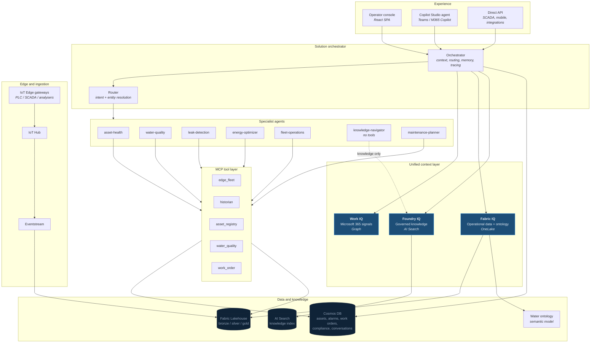
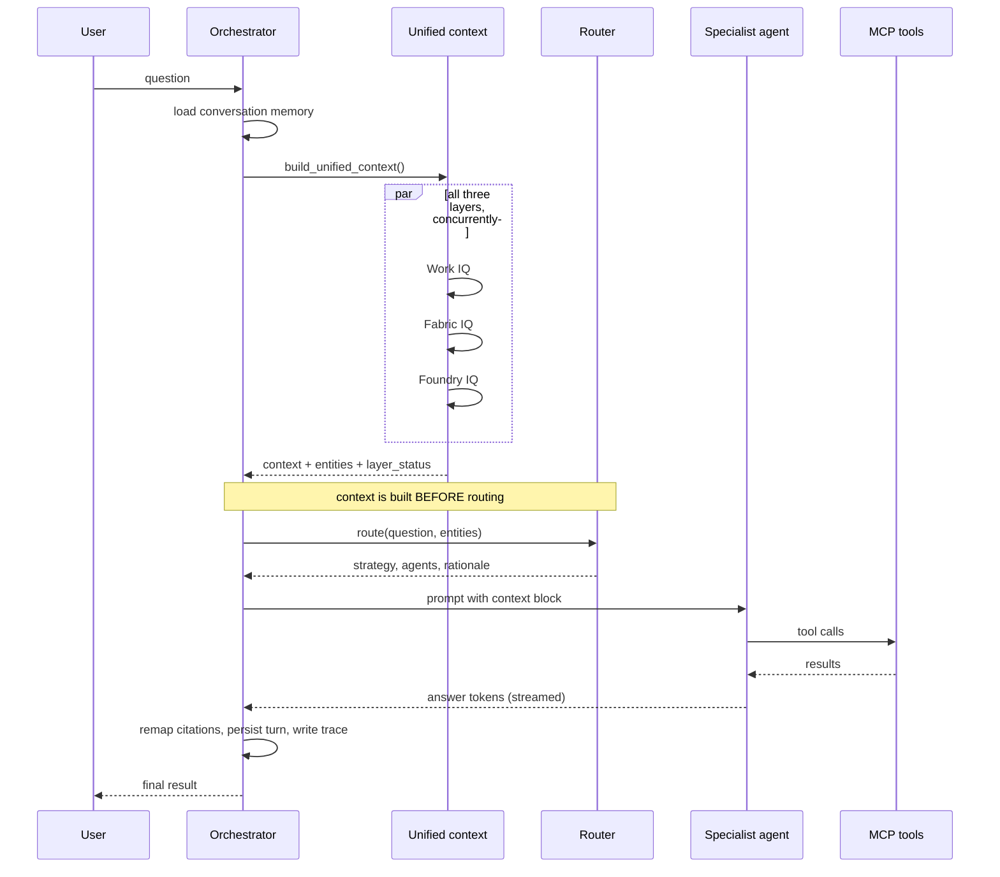
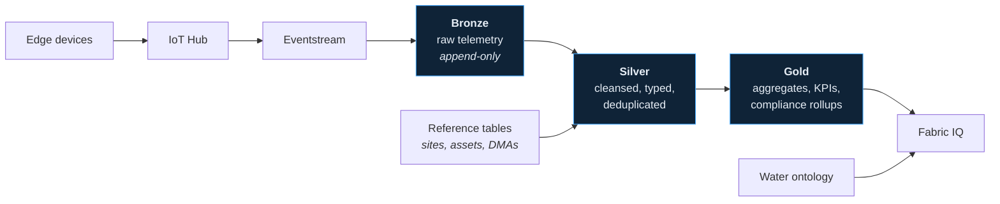

# Edge IQ architecture

Edge IQ is a multi-agent intelligence layer for a water utility's IoT Edge
estate. It follows the Microsoft IQ solution orchestrator pattern: a unified
context layer assembled from three IQ services, feeding an orchestrator that
routes questions to specialist agents, which act through MCP tools.

This document describes what each component does, why it is there, and what
happens when it is absent.

---

## 1. The shape of the system

---

## 2. Request lifecycle

A single turn runs in a fixed order. The order matters and is worth
understanding, because it is the difference between a router that guesses and
a router that knows.

### Why context comes first

Routing on the raw question alone is unreliable. "Is 7.9 too high?" contains no
device, no units and no domain. Once the context layer has resolved `7.9` in the
presence of `WTP-01-PUMP-003` and a vibration series, the router has entities to
work with and picks `asset-health` with confidence.

The three layers are gathered with `asyncio.gather(..., return_exceptions=True)`.
A failure in one layer degrades that layer and records it in `layer_status`;
it does not fail the turn. An answer grounded in two of three layers is still
useful, provided the user can see which one was missing — which is why
`layer_status` is surfaced in the UI rather than logged and forgotten.

---

## 3. The three IQ layers

Each layer answers a different question about the same event.

| Layer | Question it answers | Source | Without it |
|---|---|---|---|
| **Work IQ** | What have *people* said and decided about this? | Microsoft Graph — Teams, SharePoint, Outlook, Planner | Answers lose organisational memory; you get the reading but not the fact that someone already investigated it |
| **Fabric IQ** | What is the *data* doing? | OneLake lakehouse, resolved through the water ontology | No telemetry, no trends, no estate-wide comparison |
| **Foundry IQ** | What does the *standard* say? | AI Search over governed documents | Recommendations become unsourced opinion |

The combination is the point. A vibration reading is a number; a vibration
reading plus ISO 10816-3 plus the asset's rated power is an engineering
judgement; add the Teams thread where a technician noted a coupling change last
month and it becomes a diagnosis.

See [iq-layers.md](./iq-layers.md) for per-layer configuration, degradation
behaviour and extension points.

---

## 4. Orchestration and routing

The orchestrator is deliberately thin. It owns sequencing, memory, citation
remapping and tracing — not domain logic, which belongs to the agents.

**Routing strategies**

| Strategy | When | Behaviour |
|---|---|---|
| `single` | One clear domain | Direct to one specialist |
| `parallel` | Independent sub-questions | Fan out, merge results |
| `handoff` | Sequential dependency | One agent's output feeds the next |
| `magentic` | Open-ended or ambiguous | Planner decomposes the task dynamically |

The router returns a `RouteDecision` carrying the strategy, the agents, a
confidence and a human-readable rationale. All of it is surfaced in the UI. A
recommendation an operator cannot trace to a named agent and a cited source is
not actionable in a regulated environment.

See [agents.md](./agents.md) for the full roster and routing rules.

---

## 5. Tools and the write boundary

Agents reach operational systems only through MCP servers. Five servers expose
narrow, typed tools; a gateway fronts them.

Tool entitlements are per agent, not global. `knowledge-navigator` holds **zero**
tools by design — the agent that reads procedures cannot touch a device.

**Writes are gated by two independent keys:**

1. The tool call must carry `approved=true`
2. The deployment must set `EDGEIQ_ALLOW_WRITES=true`

Neither a model nor a UI click can satisfy both. Without both, the action is
prepared, returned as a pending approval, and `committed` is `false`.

See [mcp-servers.md](./mcp-servers.md).

---

## 6. Data platform

**Cosmos DB** holds the transactional side — asset registry, alarms, work
orders, compliance records, plus conversation history and traces.

**Fabric Lakehouse / OneLake** holds the analytical side in a medallion
layout. Gold tables are what Fabric IQ queries.

**The ontology** maps business vocabulary to physical tables. It is why
"chlorine" resolves to a water quality measurement and "pump" resolves to an
asset class, through a four-tier resolution order (entity name → entity synonym
→ attribute allowed values → attribute name). Extend the ontology's `synonyms`
before touching any code — most vocabulary gaps are ontology gaps.

See [data-platform.md](./data-platform.md).

---

## 7. Graceful degradation

Every layer has a local fallback. With `EDGEIQ_DEMO_MODE=true` and no Azure
resources at all, the system runs end to end against generated data.

| Component | Cloud | Demo fallback |
|---|---|---|
| Foundry IQ | AI Search index | Local JSON corpus |
| Fabric IQ | OneLake / SQL endpoint | Generated CSVs |
| Work IQ | Microsoft Graph | Placeholder notes |
| Memory | Cosmos DB | In-process dicts |
| Agents | Foundry Agent Service | Local deterministic agents |
| MCP data | Cosmos / Lakehouse | `data/customdata` |

This is a development convenience, but it is also the test path. The demo mode
route is the one covered by the smoke suites, so it is the one known to work.

---

## 8. Security posture

- **Managed identity** everywhere; no keys in configuration
- **On-Behalf-Of** flow for Work IQ, so Microsoft 365 content is retrieved as
  the signed-in user and existing permissions apply unchanged
- **Classification ceiling** enforced as a query-time filter predicate in AI
  Search — not a post-retrieval scrub, so restricted content is never
  materialised
- **Private endpoints** available for all data services
- **Two-key writes** as described above
- **Per-agent tool entitlements** rather than a shared tool pool

---

## 9. Where things live

| Concern | Path |
|---|---|
| Orchestrator | `src/api/python/orchestrator.py` |
| IQ layers | `src/api/python/iq/` |
| Agent definitions | `src/api/python/agents/registry.py` |
| Routing rules | `src/api/python/agents/routing.py` |
| MCP servers | `src/mcp_servers/servers/` |
| Ontology | `fabric/ontology/water_utility_ontology.yaml` |
| Knowledge base | `documents/knowledge-base/` |
| Infrastructure | `infra/bicep/modules/` |
| Demo scenarios | `data/scenarios/` |
| Copilot Studio package | `copilot-studio/` |

---

## Related documents

- [Deployment guide](./deployment.md)
- [IQ layers in detail](./iq-layers.md)
- [Agent roster and routing](./agents.md)
- [MCP servers and tools](./mcp-servers.md)
- [Data platform](./data-platform.md)
- [Work IQ setup](./work-iq-setup.md)
- [Copilot Studio setup](./copilot-studio-setup.md)
- [Configuration reference](./configuration.md)
- [Demo guide](./demo-guide.md)
